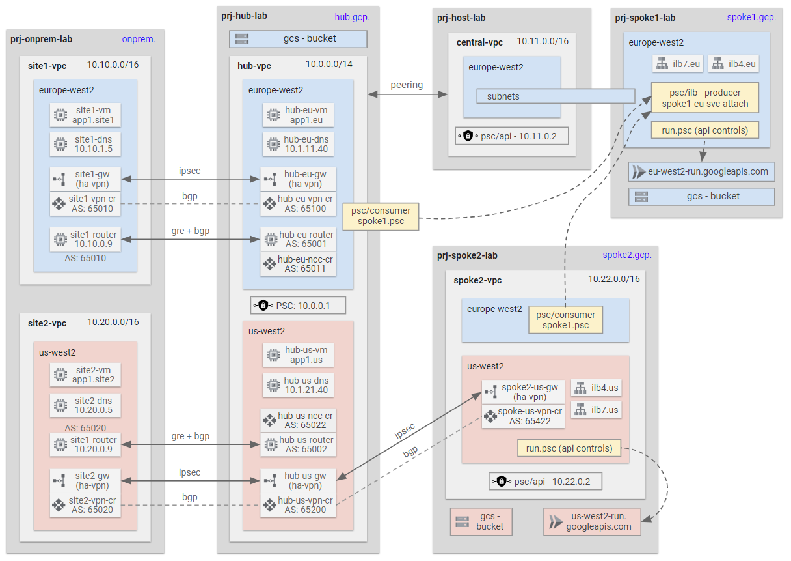

# LAB C: Hub and Spoke with Appliance GRE Tunnel to On-premises <!-- omit from toc -->

Contents
- [Overview](#overview)
- [Prerequisites](#prerequisites)
- [Deploy the Lab](#deploy-the-lab)
- [Troubleshooting](#troubleshooting)
- [Outputs](#outputs)
- [Testing](#testing)
  - [1. Test Site1 (On-premises)](#1-test-site1-on-premises)
  - [2. test from Spoke1 (Cloud)](#2-test-from-spoke1-cloud)
- [Cleanup](#cleanup)
- [Requirements](#requirements)
- [Inputs](#inputs)
- [Outputs](#outputs-1)

## Overview

In this lab:

* A hub and spoke architecure with two spokes.
* All north-south and east-west traffic are allowed via VPC firewall rules.
* Hybrid connectivity to simulated on-premises sites is achieved using HA VPN underlay and GRE overlay with BGP routing on Vyos network virtual appliances (NVA).
* Network Connectivity Center (NCC) is used to connect the on-premises sites together via the external Hub VPC.
* Other networking features such as Cloud DNS, PSC for Google APIs and load balancers are also deployed in this lab.



## Prerequisites

Ensure you meet all requirements in the [prerequisites](../../prerequisites/README.md) before proceeding.

## Deploy the Lab

1. Clone the Git Repository for the Labs

   ```sh
   git clone https://github.com/kaysalawu/gcp-network-terraform.git
   ```

2. Navigate to the lab directory

   ```sh
   cd gcp-network-terraform/1-blueprints-c-vyos-gre
   ```
3. (Optional) If you want to enable additional features such as IPv6, VPC flow logs and logging set the following variables to `true` in the [`01-main.tf`](./01-main.tf) file.

   | Variable | Description | Default | Link |
   |----------|-------------|---------|------|
   | enable_ipv6 | Enable IPv6 on all supported resources | false | [main.tf](./01-main.tf#L21) |
   ||||

4. Run the following terraform commands and type ***yes*** at the prompt:

   ```sh
   terraform init
   terraform plan
   terraform apply -parallelism=50
   ```

## Troubleshooting

See the [troubleshooting](../../troubleshooting/README.md) section for tips on how to resolve common issues that may occur during the deployment of the lab.

## Outputs

The table below shows the auto-generated output files from the lab. They are located in the `_output` directory.

| Item    | Description  | Location |
|--------|--------|--------|
| Hub Unbound DNS | Unbound DNS configuration | [_output/hub-unbound.sh](./_output/hub-unbound.sh) |
| Site1 Unbound DNS | Unbound DNS configuration | [_output/site1-unbound.sh](./_output/site1-unbound.sh) |
| Site2 Unbound DNS | Unbound DNS configuration | [_output/site2-unbound.sh](./_output/site2-unbound.sh) |
| Site1 Router | VyOS router configuration | [_output/site1-router.sh](./_output/site1-router.sh) |
| Site2 Router | VyOS router configuration | [_output/site2-router.sh](./_output/site2-router.sh) |
| Web server | Python Flask web server, test scripts | [_output/vm-startup.sh](./_output/vm-startup.sh) |
||||

## Testing

Each virtual machine (VM) is pre-configured with a shell [script](../../scripts/startup/gce.sh) to run various types of network reachability tests. Serial console access has been configured for all virtual machines. In each VM instance, The pre-configured test script `/usr/local/bin/playz` can be run from the SSH terminal to test network reachability.

The full list of the scripts in each VM instance is shown below:

```sh
$ ls -l /usr/local/bin/
-rwxr-xr-x 1 root root   98 Aug 17 14:58 aiz
-rwxr-xr-x 1 root root  203 Aug 17 14:58 bucketz
-rw-r--r-- 1 root root 1383 Aug 17 14:58 discoverz.py
-rwxr-xr-x 1 root root 1692 Aug 17 14:58 pingz
-rwxr-xr-x 1 root root 5986 Aug 17 14:58 playz
-rwxr-xr-x 1 root root 1957 Aug 17 14:58 probez
```

### 1. Test Site1 (On-premises)

**1.1** Login to the instance `c-site1-vm` using the [SSH-in-Browser](https://cloud.google.com/compute/docs/ssh-in-browser) from the Google Cloud console.

**1.2** Run the `playz` script to test network reachability to all VM instances.

```sh
playz
```

<details>

<summary>Sample output</summary>

```sh
admin_cloudtuple_com@c-site1-vm:~$ playz

 apps ...

200 (0.008221s) - 10.10.1.9 - app1.site1.onprem:8080/
200 (0.299675s) - 10.20.1.9 - app1.site2.onprem:8080/
200 (0.016640s) - 10.1.11.70 - ilb4.eu.hub.gcp:8080/
200 (0.295279s) - 10.1.21.70 - ilb4.us.hub.gcp:8080/
200 (0.040323s) - 10.1.11.80 - ilb7.eu.hub.gcp/
000 (2.002954s) -  - ilb7.us.hub.gcp/
200 (0.012683s) - 10.11.11.30 - ilb4.eu.spoke1.gcp:8080/
200 (0.293485s) - 10.22.21.30 - ilb4.us.spoke2.gcp:8080/
200 (0.039661s) - 10.11.11.40 - ilb7.eu.spoke1.gcp/
200 (0.721495s) - 10.22.21.40 - ilb7.us.spoke2.gcp/

 psc4 ...

000 (0.015510s) -  - psc4.consumer.spoke2-us-svc.psc.hub.gcp:8080
000 (0.015485s) -  - psc4.consumer.spoke2-us-svc.psc.spoke1.gcp:8080

 apis ...

204 (0.002409s) - 216.58.212.202 - www.googleapis.com/generate_204
204 (0.007985s) - 10.1.0.1 - storage.googleapis.com/generate_204
204 (0.048887s) - 10.1.11.80 - europe-west2-run.googleapis.com/generate_204
204 (0.791544s) - 10.22.21.40 - us-west2-run.googleapis.com/generate_204
204 (0.047767s) - 10.1.11.80 - europe-west2-run.googleapis.com/generate_204
204 (0.730820s) - 10.22.21.40 - us-west2-run.googleapis.com/generate_204
200 (0.038506s) - 10.1.0.1 - https://c-hub-us-run-httpbin-i6ankopyoa-nw.a.run.app/
200 (0.036997s) - 10.1.0.1 - https://c-spoke1-eu-run-httpbin-2zcsnlaqcq-nw.a.run.app/
200 (0.208821s) - 10.1.0.1 - https://c-spoke2-us-run-httpbin-bttbo6m6za-wl.a.run.app/
204 (0.008984s) - 10.1.0.1 - chuball.p.googleapis.com/generate_204
204 (0.002172s) - 142.250.187.202 - cspoke1sec.p.googleapis.com/generate_204
204 (0.002413s) - 142.250.179.234 - cspoke2sec.p.googleapis.com/generate_204
```

</details>
<p>

**1.3** Run the `pingz` script to test ICMP reachability to all VM instances.

```sh
pingz
```

<details>

<summary>Sample output</summary>

```sh
admin_cloudtuple_com@c-site1-vm:~$ pingz

 ping ...

app1.site1.onprem - OK 0.018 ms
app1.site2.onprem - OK 140.629 ms
ilb4.eu.hub.gcp - NA
ilb4.us.hub.gcp - NA
ilb7.eu.hub.gcp - NA
ilb7.us.hub.gcp - NA
ilb4.eu.spoke1.gcp - NA
ilb4.us.spoke2.gcp - NA
ilb7.eu.spoke1.gcp - NA
ilb7.us.spoke2.gcp - NA
```

</details>
<p>

**1.4** Run the `bucketz` script to test access to selected Google Cloud Storage buckets.

```sh
bucketz
```

<details>

<summary>Sample output</summary>

```sh
admin_cloudtuple_com@c-site1-vm:~$ bucketz

hub : <--- HUB EU --->

spoke1 : <--- SPOKE 1 --->

spoke2 : <--- SPOKE 2 --->
```

</details>
<p>

**1.5** On your local terminal or Cloud Shell, run the `discoverz.py` script to test access to all Google API endpoints.

```sh
gcloud compute ssh c-site1-vm \
--project $TF_VAR_project_id_onprem \
--zone europe-west2-b \
-- 'python3 /usr/local/bin/discoverz.py' | tee  _output/site1-api-discovery.txt
```

The script save the output to the file [_output/site1-vm-api-discoverz.sh`](./_output/site1-api-discovery.txt).

### 2. test from Spoke1 (Cloud)

Login to the instance `c-spoke1-eu-ilb4-vm` using the [SSH-in-Browser](https://cloud.google.com/compute/docs/ssh-in-browser) from the Google Cloud console.


```sh
playz
```

<details>

<summary>Sample output</summary>

```sh
admin_cloudtuple_com@c-spoke1-eu-ilb4-vm:~$ playz

 apps ...

200 (0.015166s) - 10.10.1.9 - app1.site1.onprem:8080/
200 (0.294194s) - 10.20.1.9 - app1.site2.onprem:8080/
200 (0.008408s) - 10.1.11.70 - ilb4.eu.hub.gcp:8080/
200 (0.290264s) - 10.1.21.70 - ilb4.us.hub.gcp:8080/
200 (0.034985s) - 10.1.11.80 - ilb7.eu.hub.gcp/
000 (2.002696s) -  - ilb7.us.hub.gcp/
200 (0.006816s) - 10.11.11.30 - ilb4.eu.spoke1.gcp:8080/
200 (0.291509s) - 10.22.21.30 - ilb4.us.spoke2.gcp:8080/
200 (0.033300s) - 10.11.11.40 - ilb7.eu.spoke1.gcp/
200 (0.715193s) - 10.22.21.40 - ilb7.us.spoke2.gcp/

 psc4 ...

000 (0.016254s) -  - psc4.consumer.spoke2-us-svc.psc.hub.gcp:8080
000 (0.016760s) -  - psc4.consumer.spoke2-us-svc.psc.spoke1.gcp:8080

 apis ...

204 (0.003368s) - 142.250.179.234 - www.googleapis.com/generate_204
204 (0.002536s) - 10.11.0.2 - storage.googleapis.com/generate_204
204 (0.069409s) - 10.11.11.40 - europe-west2-run.googleapis.com/generate_204
000 (2.002601s) -  - us-west2-run.googleapis.com/generate_204
204 (0.059441s) - 10.11.11.40 - europe-west2-run.googleapis.com/generate_204
000 (2.002652s) -  - us-west2-run.googleapis.com/generate_204
200 (0.037231s) - 10.11.0.2 - https://c-hub-us-run-httpbin-i6ankopyoa-nw.a.run.app/
200 (0.031984s) - 10.11.0.2 - https://c-spoke1-eu-run-httpbin-2zcsnlaqcq-nw.a.run.app/
200 (0.178510s) - 10.11.0.2 - https://c-spoke2-us-run-httpbin-bttbo6m6za-wl.a.run.app/
000 (0.015641s) -  - chuball.p.googleapis.com/generate_204
204 (0.004504s) - 10.11.0.2 - cspoke1sec.p.googleapis.com/generate_204
204 (0.276594s) - 10.22.0.2 - cspoke2sec.p.googleapis.com/generate_204
```

</details>
<p>

**1.3** Run the `pingz` script to test ICMP reachability to all VM instances.

```sh
pingz
```

<details>

<summary>Sample output</summary>

```sh
admin_cloudtuple_com@c-spoke1-eu-ilb4-vm:~$ pingz

 ping ...

app1.site1.onprem - OK 3.037 ms
app1.site2.onprem - OK 138.960 ms
ilb4.eu.hub.gcp - NA
ilb4.us.hub.gcp - NA
ilb7.eu.hub.gcp - NA
ilb7.us.hub.gcp - NA
ilb4.eu.spoke1.gcp - OK 0.032 ms
ilb4.us.spoke2.gcp - NA
ilb7.eu.spoke1.gcp - NA
ilb7.us.spoke2.gcp - NA
```

</details>
<p>

**1.4** Run the `bucketz` script to test access to selected Google Cloud Storage buckets.

```sh
bucketz
```

<details>

<summary>Sample output</summary>

```sh
admin_cloudtuple_com@c-spoke1-eu-ilb4-vm:~$ bucketz

hub : <--- HUB EU --->

spoke1 : <--- SPOKE 1 --->

spoke2 : <--- SPOKE 2 --->
```

</details>
<p>

**1.5** On your local terminal or Cloud Shell, run the `discoverz.py` script to test access to all Google API endpoints.

```sh
gcloud compute ssh c-spoke1-eu-ilb4-vm \
--project $TF_VAR_project_id_spoke1 \
--zone europe-west2-b \
-- 'python3 /usr/local/bin/discoverz.py' | tee  _output/spoke1-api-discovery.txt
```

The script save the output to the file [_output/spoke1-api-discovery.txt`](./_output/spoke1-api-discovery.txt).

## Cleanup

1\. (Optional) Navigate back to the lab directory (if you are not already there).

```sh
cd gcp-network-terraform/1-blueprints-c-vyos-gre
```

2\. Run terraform destroy twice.

The second run is required to delete the the *null_resource* resource that could not be deleted on teh first run due to race conditions.

```sh
terraform destroy -auto-approve
terraform destroy -auto-approve
```

<!-- BEGIN_TF_DOCS -->
## Requirements

No requirements.

## Inputs

| Name | Description | Type | Default | Required |
|------|-------------|------|---------|:--------:|
| <a name="input_bgp_range"></a> [bgp\_range](#input\_bgp\_range) | bgp interface ip cidr ranges. | `map(string)` | <pre>{<br>  "cidr1": "169.254.101.0/30",<br>  "cidr10": "169.254.110.0/30",<br>  "cidr2": "169.254.102.0/30",<br>  "cidr3": "169.254.103.0/30",<br>  "cidr4": "169.254.104.0/30",<br>  "cidr5": "169.254.105.0/30",<br>  "cidr6": "169.254.106.0/30",<br>  "cidr7": "169.254.107.0/30",<br>  "cidr8": "169.254.108.0/30",<br>  "cidr9": "169.254.109.0/30"<br>}</pre> | no |
| <a name="input_disk_size"></a> [disk\_size](#input\_disk\_size) | disk size | `string` | `"20"` | no |
| <a name="input_disk_type"></a> [disk\_type](#input\_disk\_type) | disk type | `string` | `"pd-ssd"` | no |
| <a name="input_gre_range"></a> [gre\_range](#input\_gre\_range) | gre interface ip cidr ranges. | `map(string)` | <pre>{<br>  "cidr1": "172.16.1.0/24",<br>  "cidr2": "172.16.2.0/24",<br>  "cidr3": "172.16.3.0/24",<br>  "cidr4": "172.16.4.0/24",<br>  "cidr5": "172.16.5.0/24",<br>  "cidr6": "172.16.6.0/24",<br>  "cidr7": "172.16.7.0/24",<br>  "cidr8": "172.16.8.0/24"<br>}</pre> | no |
| <a name="input_image_cos"></a> [image\_cos](#input\_image\_cos) | container optimized image | `string` | `"cos-cloud/cos-stable"` | no |
| <a name="input_image_debian"></a> [image\_debian](#input\_image\_debian) | vm instance image | `string` | `"debian-cloud/debian-12"` | no |
| <a name="input_image_panos"></a> [image\_panos](#input\_image\_panos) | palo alto image from gcp marketplace | `string` | `"https://www.googleapis.com/compute/v1/projects/paloaltonetworksgcp-public/global/images/vmseries-bundle1-810"` | no |
| <a name="input_image_ubuntu"></a> [image\_ubuntu](#input\_image\_ubuntu) | vm instance image | `string` | `"ubuntu-os-cloud/ubuntu-2404-lts-amd64"` | no |
| <a name="input_image_vyos"></a> [image\_vyos](#input\_image\_vyos) | vyos image from gcp marketplace | `string` | `"https://www.googleapis.com/compute/v1/projects/sentrium-public/global/images/vyos-1-3-0"` | no |
| <a name="input_machine_type"></a> [machine\_type](#input\_machine\_type) | vm instance size | `string` | `"e2-micro"` | no |
| <a name="input_organization_id"></a> [organization\_id](#input\_organization\_id) | organization id | `any` | `null` | no |
| <a name="input_project_id_host"></a> [project\_id\_host](#input\_project\_id\_host) | host project id | `any` | n/a | yes |
| <a name="input_project_id_hub"></a> [project\_id\_hub](#input\_project\_id\_hub) | hub project id | `any` | n/a | yes |
| <a name="input_project_id_onprem"></a> [project\_id\_onprem](#input\_project\_id\_onprem) | onprem project id (for onprem site1 and site2) | `any` | n/a | yes |
| <a name="input_project_id_spoke1"></a> [project\_id\_spoke1](#input\_project\_id\_spoke1) | spoke1 project id (service project id attached to the host project | `any` | n/a | yes |
| <a name="input_project_id_spoke2"></a> [project\_id\_spoke2](#input\_project\_id\_spoke2) | spoke2 project id (standalone project) | `any` | n/a | yes |
| <a name="input_shielded_config"></a> [shielded\_config](#input\_shielded\_config) | Shielded VM configuration of the instances. | `map` | <pre>{<br>  "enable_integrity_monitoring": true,<br>  "enable_secure_boot": true,<br>  "enable_vtpm": true<br>}</pre> | no |

## Outputs

No outputs.
<!-- END_TF_DOCS -->
